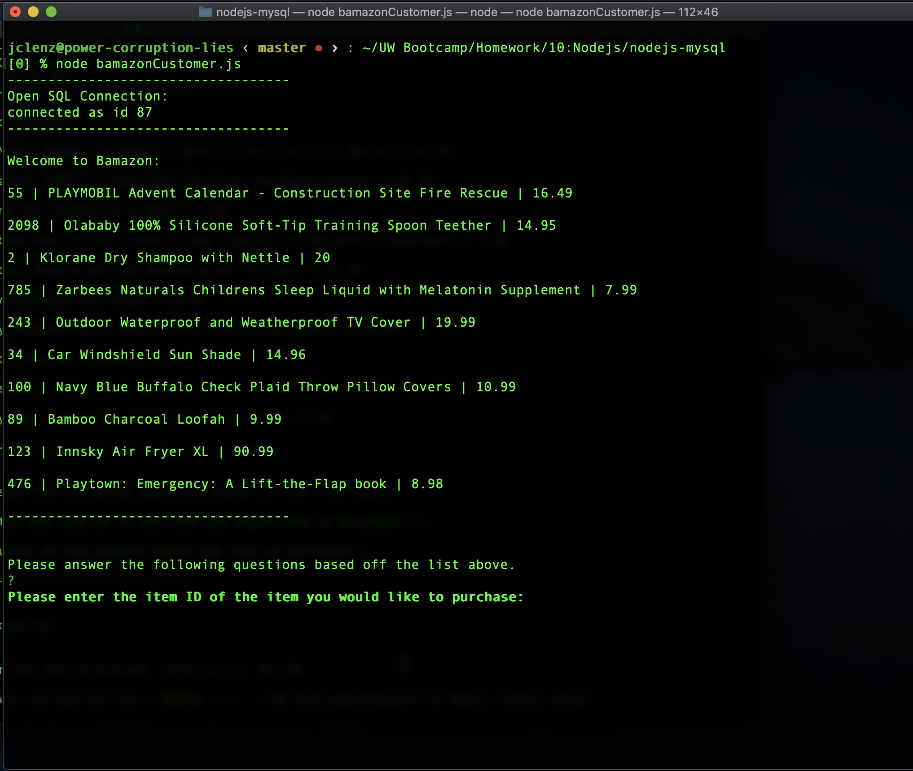

# Bamazon
Bamazon is an Amazon-like storefront using MySQL and Node.js. The app will take in orders from customers and deplete stock from the store's inventory. 

## Technologies used:

* Node.js
* Javascript
* MySQL Server
* SQL

## npm Packages:
* [mysql](https://www.npmjs.com/package/mysql)
* [inquirer](https://www.npmjs.com/package/inquirer)

## How to Run Bamazon
Run the application using the following command:

```
node bamazonCustomer.js
```

___

## Customer Demo <a id="customer-demo"></a>
The customer interface:

```
1) Presents the customer with a table of all available products
2) Asks for the ID of the customer's desired product
3) Asks how many items the customer would like to purchase
4) Confirms order & updates product inventory in database
```
<<<<<<< HEAD

=======

>>>>>>> 991e0340bf5501b7813ab2e719f6f30b9aa4d0b5

Below is a screen recording of the app working:

[Screen Recording](screenshots/bamazon_recording.m4v)

## Author
* **JC Lenz** 
